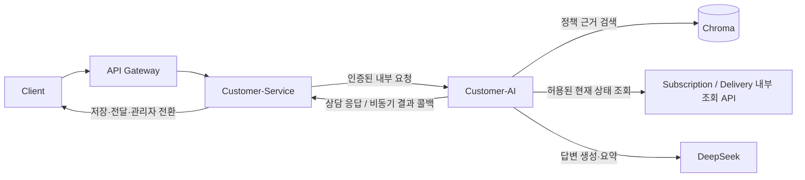
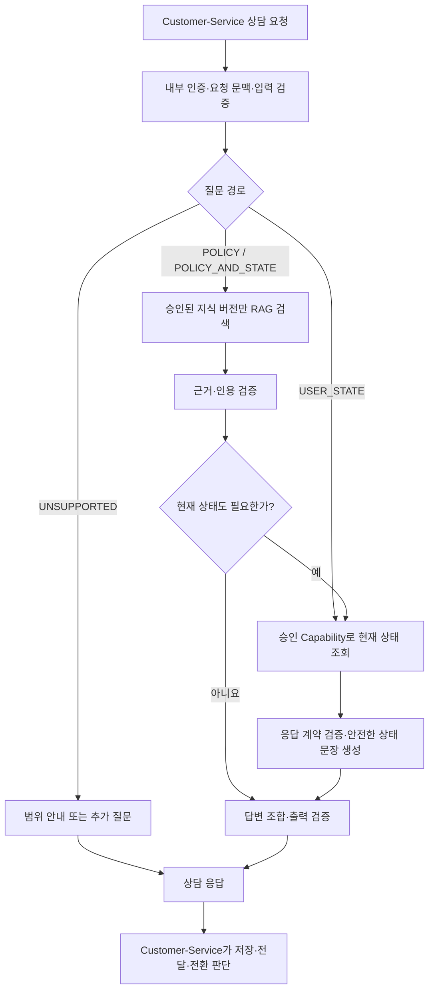
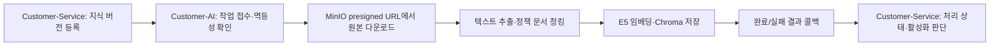
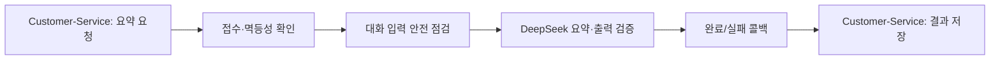

# chapchap-customer-ai

챱챱 고객 상담을 지원하는 **Customer-Service 전용 내부 Python/FastAPI AI Runtime**이다. Customer-Service가 상담 요청과 검증된 사용자 문맥을 전달하면, 이 서비스는 정책 근거 검색 또는 승인된 현재 상태 조회를 거쳐 답변과 판단 신호를 반환한다. 지식 문서의 벡터화와 상담 종료 후 요약도 담당한다.

## 담당 범위와 서비스 경계

| Customer-AI가 담당 | 다른 서비스가 담당 |
|---|---|
| 질문 경로 분류, 정책 RAG 검색, 승인된 현재 상태 조회 및 답변 생성 | Customer-Service: 상담 생성·메시지 저장·관리자 전환·사용자에게 전달 |
| 지식 원본 추출·청킹·임베딩·Chroma 인덱싱, 처리 결과 콜백 | Customer-Service: 지식 버전 등록·활성화·처리 상태의 최종 반영 |
| 상담 대화 요약 생성과 결과 콜백 | Customer-Service: 요약 작업 요청·결과 저장 |
| 조회 결과의 계약 검증·정규화 | Subscription/Delivery: 실제 결제·환불·구독·배송 상태와 조회 규칙 |

Customer-AI는 Customer DB나 Domain DB에 직접 접근하지 않는다. 상태 변경, 환불·취소 실행, SQL 생성, Kafka Command 발행도 하지 않는다. 정책은 **RAG**, 개인의 실시간 상태는 **승인된 읽기 전용 Capability**로 처리한다.



## 세 가지 주요 흐름

### 1. 상담 응답: 질문에서 답변까지

Customer-Service가 상담 ID, 사용자 문맥, 허용 Scope, 활성 지식 버전 ID를 포함한 요청을 보낸다. Customer-AI는 Service JWT와 Subject Assertion을 검증하고, 요청 본문이 검증된 사용자와 일치하는지 확인한다. 이후 입력을 점검하고 질문을 `POLICY`, `USER_STATE`, `POLICY_AND_STATE`, `UNSUPPORTED`로 분류한다.



- **정책:** 요청에 담긴 `knowledgeVersionIds`로 검색 범위를 제한한다. 비어 있거나 검색 근거가 없으면 전체 문서 검색으로 넓히지 않는다. 검색 결과와 DeepSeek가 사용했다고 밝힌 chunk ID를 대조한 뒤 인용 정보를 반환한다.
- **현재 상태:** 질문에서 결제·환불·구독·배송 Capability를 고른다. 검증된 Subject와 Scope로만 Subscription/Delivery 내부 조회 API를 호출하고, 응답을 안전한 상태 정보로 정규화한다. 한 요청에서 최대 2개 Capability를 조회한다.
- **결과:** 응답에는 `decision`, `route`, `degraded`, `handoffRequired` 및 필요한 경우 근거가 포함된다. 조회 실패나 계약 오류를 정상 업무 상태로 추측하지 않는다. 답할 수 있는 부분만 답하거나 관리자 확인 신호를 보내며, 실제 전환과 저장은 Customer-Service가 수행한다.

### 2. 지식 처리: 등록된 문서에서 검색 가능한 근거까지

Customer-Service가 지식 버전과 검증된 원본의 presigned URL을 전달하면, Customer-AI는 작업을 접수(`202 ACCEPTED`)하고 비동기로 처리한다.



문서는 `HYBRID_POLICY_V1` 프로필로 나누고 `intfloat/multilingual-e5-small` 임베딩을 사용한다. 저장된 chunk는 이후 상담의 정책 근거가 된다. 원본 다운로드·추출·저장 중 실패하면 실패 코드와 재시도 가능 여부를 콜백한다. Customer-AI가 지식 버전을 스스로 활성화하지는 않는다.

### 3. 상담 요약: 종료 후 비동기 결과 전달

Customer-Service의 요약 요청도 `202 ACCEPTED`로 접수한다. 메시지 길이와 안전성을 점검한 뒤 DeepSeek로 요약을 생성하고, 최대 500자 결과 또는 실패 정보를 Customer-Service에 콜백한다. 중복 요청은 멱등 키와 요청 내용을 기준으로 처리한다.



## 런타임과 연동 상태

| 모드 | 용도 | 지속성 |
|---|---|---|
| 기본 `disabled` | `GET /healthz`만 제공 | 상담·지식·요약 API 미연결 |
| `isolated` | local/test 단일 프로세스 검증 | 메모리 멱등 레지스트리·작업 큐. 재시작 복구 불가 |
| `academy` | 명시 설정된 학원 배포 | PVC의 SQLite에 작업·완료 상담 응답을 기록하고 미완료 지식/요약을 재시작 시 재전송 |

기능 API는 내부 경로 `/internal/v1/consultation-responses`, `/internal/v1/knowledge-processings`, `/internal/v1/consultation-summaries`로 제공된다. 내부 인증과 필수 의존성 설정이 없으면 기능 런타임을 시작하지 않는다. Callback용 서비스 토큰은 Auth Service의 client credentials 계약으로 발급받는다. 운영 진단은 구조화 로그를 사용한다.

기본 앱은 health-only다. 운영 활성화는 Customer-Service gate 및 실제 의존성 검증과 별개다.

## 학원 배포 모드

`CUSTOMER_AI_PROVIDER_RUNTIME_MODE=academy`, `CUSTOMER_AI_ENVIRONMENT=production`,
`CUSTOMER_AI_INTERNAL_SECURITY_ENABLED=true`를 명시하면 학원용 실제 기능을 실행한다.
Customer는 `CUSTOMER_AI_ACTIVATION_MODE=ACADEMY`와 인증/비동기 연동 플래그를 함께 켠다.
일반 운영 ACTIVE 승인 증거와 isolated의 local/test 제한은 그대로 유지한다.

- `CUSTOMER_AI_HTTP_ALLOWED_ORIGINS`: HTTP를 허용할 정확한 origin의 JSON 배열. 예: `["http://auth-service:80","http://customer-service:80"]`.
- `CUSTOMER_AI_KNOWLEDGE_SOURCE_HTTP_ALLOWED_ORIGINS`: 학원 MinIO의 별도 HTTP 예외 배열. 기존 source allowed hosts도 일치해야 한다.
- HTTPS 인증서, JWT 서명/audience/scope, 사용자 assertion 검증을 유지하고 redirect를 거부한다.
- `CUSTOMER_AI_RUNTIME_STATE_DIRECTORY=/data/runtime`, `CUSTOMER_AI_CHROMA_PERSIST_DIRECTORY=/data/chroma`, `HF_HOME=/data/huggingface`를 같은 PVC에 둔다.
- replica=1/worker=1/Recreate 전용이다. 파일 잠금으로 같은 runtime 볼륨의 중복 worker를 거부한다.
- SQLite에 작업 ID·fingerprint·미완료 요청·완료 상담 응답을 기록한다. 미완료 지식/요약은 재시작 시 재전송하고 완료 콜백 후 기록을 지운다. 중복 콜백의 최종 반영은 Customer가 소유한다.
- 콜백 최대 재시도 이후 실패는 PVC에 남으며 다음 재시작 때 다시 시도한다. 재시작 시 만료된 MinIO URL은 실패 콜백으로 처리해 Customer 재시도 흐름에 맡긴다. 상시 분산 큐/주기적 재전송 서비스는 아니다.
- PVC에는 상담 응답/요약 입력도 저장되므로 접근 권한과 보관·삭제 주기를 정해야 한다. 실제 운영에 앞서 보관 정책 및 다중 인스턴스용 저장/큐를 보완한다.

`Dockerfile`은 RAG 의존성을 포함하고 비root 계정으로 8085에서 실행한다. `.env`는 이미지에 포함하지 않는다. 최초 시작에는 모델 다운로드와 PVC 용량이 필요하다. 실제 클러스터 배포와 외부 서비스 호출 성공 여부는 별도 검증한다.

## 개발 준비

Python 3.11 이상이 필요하다.

```powershell
py -m venv .venv
.\.venv\Scripts\Activate.ps1
python -m pip install -e ".[dev]"
python -m pytest
python -m ruff check src tests
python -m pip check
python -m chapchap_customer_ai
```

로컬 실행 주소는 `http://127.0.0.1:8085`이며 Customer-Service의 기본 AI 주소 `http://localhost:8085`와 포트를 맞춘다. 상태 확인은 `GET /healthz`로 한다. 포트가 사용 중이면 기존 프로세스를 확인한다.

Uvicorn을 직접 실행할 때도 포트를 명시한다.

```powershell
python -m uvicorn chapchap_customer_ai.main:create_app --factory --host 127.0.0.1 --port 8085 --workers 1
```

실제 환경변수와 Credential은 저장소에 넣지 않는다. 설정 이름은 `config/provider-runtime.env.example`을 참고한다.

## 격리 Runtime

`CUSTOMER_AI_PROVIDER_RUNTIME_MODE=isolated`, `CUSTOMER_AI_ENVIRONMENT=local`, 내부 인증 활성화 및 필수 의존성 설정이 있어야 위 앱에 상담·지식처리·요약 API가 연결된다. 실제 RAG 실행에는 `.[rag]` 의존성, E5 모델과 Chroma 저장 경로가 필요하다. MinIO는 Customer가 발급한 presigned HTTPS URL과 허용 호스트만 사용한다. 설정된 앱의 실제 요청은 LLM 요금과 callback/Chroma 쓰기를 발생시킬 수 있다.

이 모드는 **단일 프로세스 검증용**이다. 메모리 멱등 레지스트리와 작업 큐는 재시작·다중 worker·콜백 장애 후 복구를 보장하지 않는다. production 환경은 거절한다. 운영에는 공유 멱등 저장소, 내구성 작업 큐/결과 재전송 및 실제 의존성 검증이 필요하다.

### Delivery 현재 상태

Delivery dev `1bfe49063e40b9067ff817165d27f13480bcd089`의 구현 계약을 기준으로 한다. Consumer 격리 검증은 완료했으나 실제 양쪽 서버 통합은 미검증이며 운영 활성화 승인이 아니다. Delivery 서버는 변경하지 않았다.

- 조회 전용 `GET /internal/deliveries/current`; query/body 없음.
- 고정 헤더: `X-Internal-Service: customer-ai`, `X-Internal-Scope: delivery.status.read`, `X-User-Role: CUSTOMER`.
- `X-User-Id`는 검증된 Customer Subject의 양의 int64만 사용한다. `X-Internal-Api-Key`는 Delivery 전용 키다.
- 성공: `{"code":"00","message":"SUCCESS","data":{"status":"DELIVERING","delayStatus":"UNKNOWN","statusChangedAt":null}}`.
- `404` + `DELIVERY_036` + null data만 업무상 부재로 처리한다. `409/DELIVERY_037`은 계약 오류, `401/403`은 권한 실패, `5xx`는 일시 불가로 구분한다.
- 자동 재시도와 리다이렉트는 없다. HTTP timeout은 남은 예산과 2초 중 작은 값이며, 늦게 수신된 응답은 TIMEOUT 처리한다. 동기 HTTP I/O의 단계별 timeout이므로 프로세스 수준의 강제 취소 보장은 아니다.

연결하려면 `CUSTOMER_AI_DELIVERY_CURRENT_STATE_BASE_URL`과 `CUSTOMER_AI_DELIVERY_CURRENT_STATE_API_KEY`를 함께 설정한다. 키는 Delivery의 `DELIVERY_CUSTOMER_AI_API_KEY`와 같아야 하며 Auth client secret과 별개다. 둘 다 미설정이면 UNAVAILABLE, 일부만 설정하면 격리 runtime 시작을 거부한다. 기본은 직접 HTTPS origin이며, 로컬 HTTP만 `CUSTOMER_AI_DELIVERY_CURRENT_STATE_ALLOW_LOOPBACK_HTTP=true`로 명시 허용할 수 있다. 실제 값은 Git에 저장하지 않는다.

자동 테스트는 외부 통신을 대체하여 JWT 검증부터 지식 처리·상담·요약 콜백까지 검증한다. 실제 Auth/JWKS/MinIO/Chroma/DeepSeek/Delivery 접속 성공을 의미하지 않는다.
